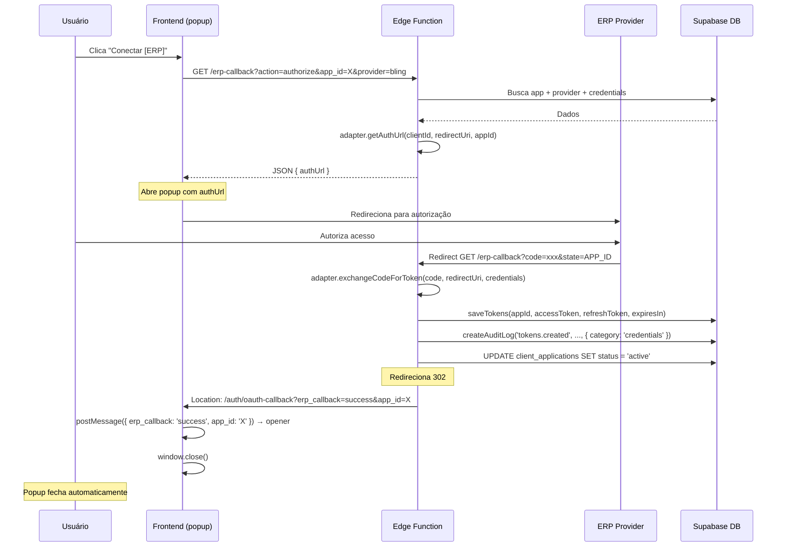
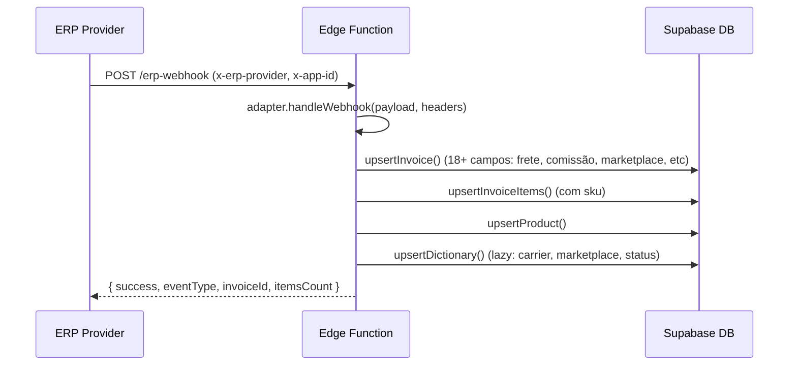
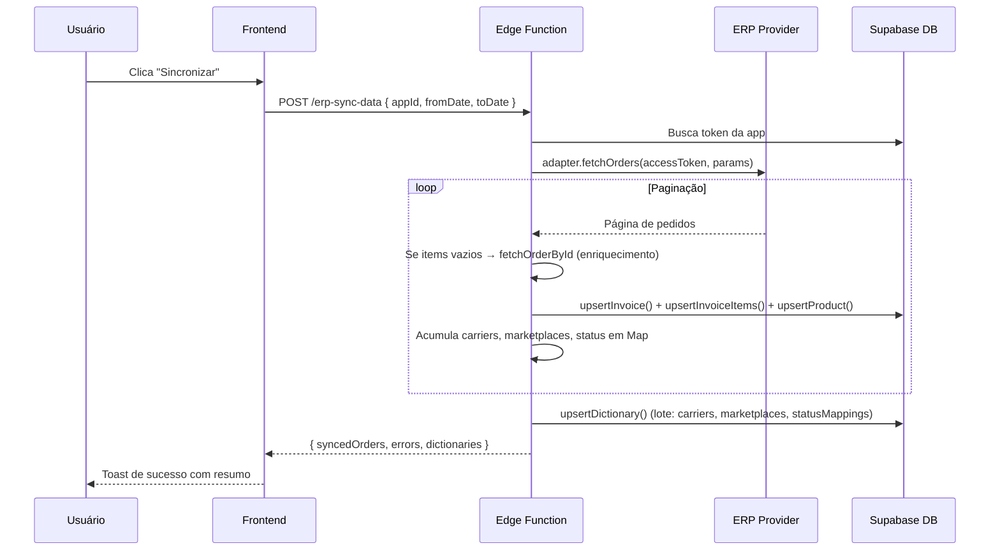

# PRD 08 — Fluxos ERP

## Visão Geral

Todos os fluxos de integração com ERPs: OAuth2, webhooks, sincronização manual.

## Fluxo OAuth2 (Conexão)

### Etapas

### Regras

- **Callback URL:** `https://{project}.supabase.co/functions/v1/erp-callback` — força HTTPS + caminho completo com `/functions/v1/`
- **Redirect do callback:** 302 para frontend (`APP_URL/auth/oauth-callback`) — resolve problema de Content-Type overriding pelo Supabase Gateway
- **Popup auto-close:** Frontend recebe params na URL, executa `postMessage`, chama `window.close()`
- **APP_URL:** Lido de `Deno.env.get('APP_URL')`, configurado via `supabase secrets set APP_URL=...`
- **Auditoria:** Cada etapa (authorize_success, token_exchanged, tokens.created, etc) registra log com `category: 'credentials'`

### Tratamento de Erros

| Etapa | Erro | Ação |
|---|---|---|
| Callback | `state` ausente ou inválido | 302 → `?erp_callback=error&message=Missing+state` |
| Callback | `code` ausente | 302 → `?erp_callback=error&message=Missing+code` |
| Callback | App não encontrado | 302 → `?erp_callback=error&message=App+not+found` |
| Token exchange | ERP retorna erro | 302 → `?erp_callback=error&message=Token+exchange+failed&details=X` + loga erro |
| Token exchange | Parse de resposta inválida | 302 → `?erp_callback=error&message=Invalid+token+response` + loga erro |

## Fluxo Webhook

### Regras

- Webhooks não autenticados — cada provedor tem assinatura própria (verificar no adapter)
- Timeout na edge function: 300s (max Supabase)
- Em caso de erro: `enqueueRetry('erp_webhook_retry')` + log `queue.enqueued`

## Fluxo Sincronização Manual

## Refresh Automático de Tokens

| Ação | Quando | Gatilho |
|---|---|---|
| Verificar tokens expirando | A cada 60 min | `pg_cron` → `SELECT jobs.trigger_refresh_tokens()` |
| Tentar refresh (max 50) | Se `expires_at <= now()` | Edge function `erp-refresh-token` |
| Marcar como 'error' | Se refresh falhar | `enqueueRetry('erp_token_retry')` + log `queue.enqueued` |
| Auditoria | Cada token processado | `createAuditLog()` com `category: 'credentials'` |

## Provedores

### Bling

| Propriedade | Valor |
|---|---|
| Tipo | OAuth2 (Basic Auth) |
| Auth URL | `https://www.bling.com.br/Api/v3/oauth/authorize` |
| Token URL | `https://www.bling.com.br/Api/v3/oauth/token` |
| Orders API | `GET /Api/v3/pedidos/vendas` |
| Rate Limit | 3 req/s, 120k req/dia, token `/oauth/token` 20 req/min |

### Tiny

| Propriedade | Valor |
|---|---|
| Tipo | OpenID Connect (Keycloak) |
| Auth URL | `https://accounts.tiny.com.br/realms/tiny/protocol/openid-connect/auth` |
| Token URL | `https://accounts.tiny.com.br/realms/tiny/protocol/openid-connect/token` |
| Scope | `openid` |
| Orders API | `GET /public-api/v3/pedidos` |
| Rate Limit | 60-240 req/min (por plano) |
| Token Expiry | Access: 4h, Refresh: 1 dia |

### Anymarket

| Propriedade | Valor |
|---|---|
| Tipo | API Key (x-api-key header) |
